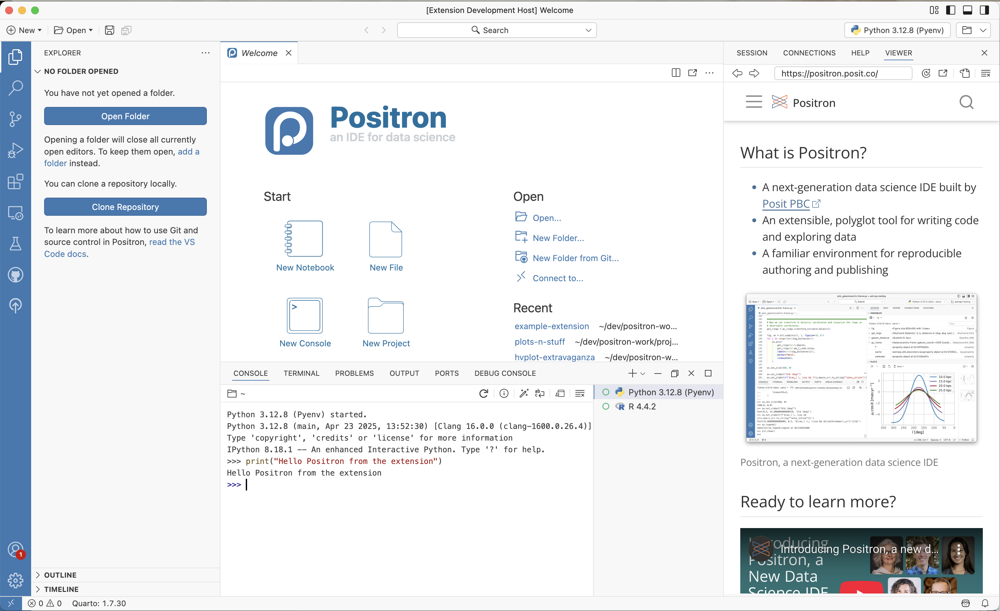

# Positron Extension Demo

This is a demo extension that shows how to use the `@posit-dev/positron-types` npm package to add custom functionality for the Positron data science IDE.

The extension demonstrates how to:
- Safely detect if running in Positron vs VS Code
- Use Positron-specific APIs like `previewUrl` and `executeCode`
- Maintain compatibility with both Positron and VS Code

## Demo

The screenshot shows the extension running in Positron, demonstrating:
- The "Hello Positron" command execution
- URL preview functionality in the viewer pane
- Code execution in the Python console

## Positron API Features

This extension demonstrates the following Positron APIs from `@posit-dev/positron-types`:

### `getPositronApi()`
- Safely detects if the extension is running in Positron
- Returns the Positron API object or `undefined` if not available

### `positron.window.previewUrl()`
- Opens URLs in Positron's built-in viewer pane
- Provides a seamless way to display web content within the IDE

### `positron.runtime.executeCode()`
- Executes code in the active runtime environment
- Supports multiple languages (Python, R, etc.)
- Allows extensions to interact with the data science workflow

## VS Code Compatibility

The extension uses standard VS Code APIs for basic functionality:

### `vscode` module
- [`commands.registerCommand`](https://code.visualstudio.com/api/references/vscode-api#commands.registerCommand)
- [`window.showInformationMessage`](https://code.visualstudio.com/api/references/vscode-api#window.showInformationMessage)

### Contribution Points
- [`contributes.commands`](https://code.visualstudio.com/api/references/contribution-points#contributes.commands)

## Running the Extension

- Run `npm install` in terminal to install dependencies
- Run the `Run Extension` target in the Debug View. This will:
	- Start a task `npm: watch` to compile the code
	- Run the extension in a new Positron or VS Code window
- Execute the "Hello Positron" command from the Command Palette

## Learn More

- [Positron Documentation](https://positron.posit.co/)
- [@posit-dev/positron-types on npm](https://www.npmjs.com/package/@posit-dev/positron-types)
